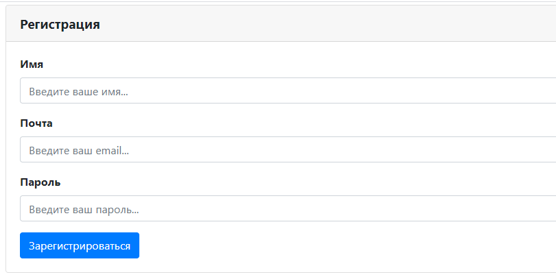
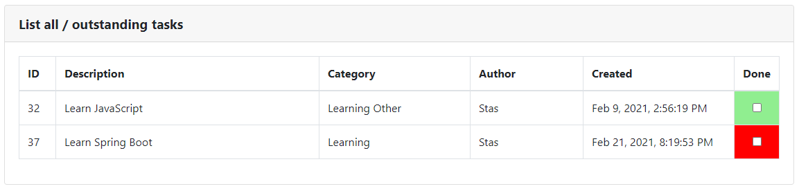

# TODOList

[](https://travis-ci.org/staskorobeynikov/job4j_todo)
[](https://codecov.io/gh/staskorobeynikov/job4j_todo)

**```Веб-приложение для создания заданий и контроля их выполнения.```**

<a name="menu"></a>
<ul>
    <li>
        <a href="#about">О проекте</a>
        <ul>
            <li><a href="#description">Описание</a></li>
            <li><a href="#technologies">Технологии</a></li>
            <li><a href="#structure">Структура</a></li>
        </ul>
    </li>
    <li>
        <a href="#use">Использование</a>
        <ul>
            <li><a href="#info">Основные возможности</a></li>
            <li><a href="#reg_auth">Регистрация / авторизация</a></li>
            <li><a href="#add_item">Добавление задания</a></li>
            <li><a href="#update_item">Обновление задания</a></li>
        </ul>
    </li>
    <li>
        <a href="#contacts">Контакты</a>
    </li>
</ul>

<h1><a name="about">О проекте</a>&emsp;<a href="#menu">&#11014;</a></h1>
<h4><a name="description">Описание</a>&emsp;<a href="#menu">&#11014;</a></h4>
<p>
    Веб-приложение для создания заданий и контроля их выполнения
</p>
<p>
    Это приложение для хранения данных о запланированных заданиях. <br>
    В приложении могут регистрироваться пользователи, создавать свои задания и делать отметки их выполнения. <br>
    Пользователь может создавать и редактировать только свои задания, при этом видит задания других пользователей.
</p>
<h4><a name="technologies">Технологии</a>&emsp;<a href="#menu">&#11014;</a></h4>
<ul>
    <li>- Java 12;</li>
    <li>- Java EE Servlets;</li>
    <li>- PostgreSQL, Hibernate, Liquibase;</li>
    <li>- JUnit, Mockito, PowerMock;</li>
    <li>- Apache Maven;</li>
    <li>- Apache Tomcat;</li>
    <li>- HTML</li>
    <li>- JavaScript, jQuery, JSON</li>
</ul>
<h4><a name="structure">Структура</a>&emsp;<a href="#menu">&#11014;</a></h4>
<pre><code>.
├───db
│   └───scripts
├───main
│   ├───java
│   │   └───todolist
│   │       ├───filter
│   │       ├───logic
│   │       ├───memory
│   │       ├───models
│   │       └───servlets
│   ├───resources
│   └───webapp
│       ├───scripts
│       └───WEB-INF
└───test
    ├───java
    │   └───todolist
    │       ├───filter
    │       ├───logic
    │       ├───memory
    │       ├───models
    │       └───servlets
    └───resources</code></pre>

<h1><a name="use">Использование</a>&emsp;<a href="#menu">&#11014;</a></h1>
<h4><a name="info">Основные возможности</a>&emsp;<a href="#menu">&#11014;</a></h4>

<p>
    Просмотр всех заданий, которые добавлены в систему доступны всем пользователям. Чтобы добавить или обновить задание -
    требуется зарегистрироваться в системе. Достигается это за счет фильтра всех запросов <code>todolist.filter.AuthFilter</code>
    Для подключения фильтра и всех сервлетов предназначен <code>src\main\webapp\WEB-INF\web.xml</code>.<br>
    Все задания могут иметь категории, при этом у задания их может быть несколько.
</p>
<h4><a name="main">Регистрация / авторизация</a>&emsp;<a href="#menu">&#11014;</a></h4>

<dl>
    <dt>Доступные адреса</dt>
    <dd>
        <code>/reg.do и /auth.do</code><br>
        <code>/</code> в режиме просмотра
    </dd>
</dl>
<p>
    Неавторизованному пользователю доступны указанные 2 страницы, а также просмотр списка заданий без возможности добавить
    и изменить задание. Также задания можно отфильтровать по признаку выполнено оно или нет.
</p>
<p align="center">
    <br><br>
    
</p>

<h4><a name="add_item">Добавление задания</a>&emsp;<a href="#menu">&#11014;</a></h4>
<p>
    Заполнение формы для добавления задания
</p>
<p align="center">
    <br><br>
</p>
<p>
    Общая таблица заданий после добавления
</p>
<p align="center">
    <br><br>
</p>

<h4><a name="update_item">Обновление задания</a>&emsp;<a href="#menu">&#11014;</a></h4>
<p>
    Обновление задания - достаточно установить галочку в колонке Done
</p>
<p align="center">
    <br><br>
</p>
<p>
    Общая таблица заданий после обновления задания
</p>
<p align="center">
    <br><br>
</p>
<p>
    После редактирования выполненное задание окрашивается в зеленый цвет, невыполненное задание будет 
    окрашено в красный цвет
</p>

<h1><a name="contacts">Контакты</a>&emsp;<a href="#menu">&#11014;</a></h1>

<p>
    По всем вопросам со мной можно связаться следующим образом:
</p>

[](https://t.me/carbonil_ks) &emsp; 
<a href="mailto:stas.karabeinikau@gmail.com"></a> &emsp;
<a href="mailto:stas.korobeinikov@mail.ru"></a>